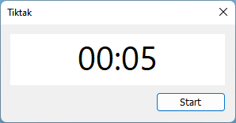

  

# Tiktak
A very simple and very lightweight timer app for Windows using pure Win32 API

# Features
* Visual and sound notifications
* View timer progress in the taskbar
* Single executable
* No bloat, no background services, almost 1 Mb RAM usage

# Build
* Microsoft Visual Studio Dev Tools is required to build this application
